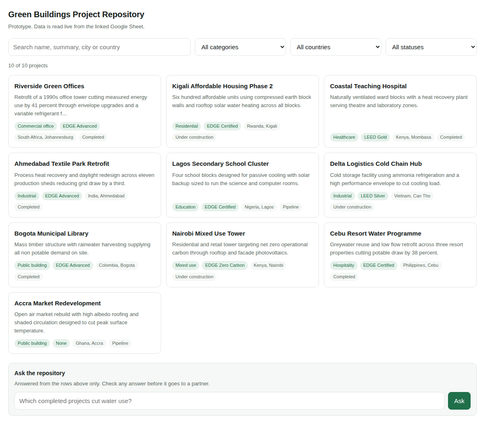

# Green Buildings Project Repository — prototype

A small, working repository built the way a low-budget team can actually maintain it: the data lives in a Google Sheet that a non-technical person edits, Apps Script reads it and serves it as JSON, and a single HTML page provides search, filtering and project detail. The page embeds into Google Sites.

Built as a demonstration piece for the UNEP/IFC MARG Green Buildings Project Repository assignment.

**Live demo:** _add your deployment URL here_

**JSON feed:** _same URL with `?format=json`_



---

## Architecture

```
Google Sheet ("Projects" tab)      the data store, edited by hand
        │
        │  SpreadsheetApp, cached 5 minutes
        ▼
Apps Script  (Code.gs)             reads, normalises, serves
        │
        ├── doGet()                  → HTML interface (HtmlService)
        ├── doGet(?format=json)      → JSON feed (ContentService)
        └── askRepository()          → optional Gemini call (UrlFetchApp)
        │
        ▼
Index.html                         search, filters, detail view
        │
        ▼
Google Sites                       embedded via the web app URL
```

Three decisions worth naming, because they are the ones that determine whether
the thing survives after handover:

1. **The sheet is the source of truth, not the code.** Column headers become
   JSON keys automatically (`Floor Area m2` becomes `floor_area_m2`). Adding a
   column to the sheet adds a field to the feed. Nobody has to open the script
   to add data.
2. **Filters are built from the data, not hardcoded.** The category, country and
   status dropdowns are derived from whatever is in the sheet, so a new category
   appears in the UI without a code change.
3. **The JSON feed is a public surface.** Anything else that needs this data
   later, a dashboard or another site, reads the feed rather than the sheet.

---

## Setup

### 1. The sheet

Create a Google Sheet, rename the first tab to `Projects`, and import
`sample-data.csv` (File → Import → Upload → Replace current sheet).

The header row is what drives everything. The sample uses:

| Column | Used for |
|---|---|
| `id` | reference shown in the detail view |
| `name` | card title, searched |
| `country`, `city` | filter and search |
| `category` | filter, tag |
| `certification` | filter facet, tag |
| `status` | filter, tag |
| `year`, `floor_area_m2` | detail view |
| `summary` | card body, searched |
| `link` | detail view button |

Any column you add appears in the JSON feed. Only the ones listed above are
rendered by the current UI.

### 2. The script

From the sheet: **Extensions → Apps Script**.

- Paste `Code.gs` over the default `Code.gs`.
- **File → New → HTML** named `Index`, paste `Index.html` into it.
- To use `appsscript.json` as supplied: **Project Settings → tick "Show
  appsscript.json manifest file"**, then paste it over the generated manifest.

### 3. Deploy

**Deploy → New deployment → Web app**

- Execute as: **Me**
- Who has access: **Anyone** (required for a Google Sites embed to work for
  visitors who are not signed in)

Authorise when prompted. Copy the `/exec` URL.

Check both entry points:

```
<web app url>                 → the interface
<web app url>?format=json     → the feed
```

### 4. Embed in Google Sites

In your Site: **Insert → Embed → By URL**, paste the `/exec` URL, and stretch
the frame to full width. `setXFrameOptionsMode(ALLOWALL)` in `doGet()` is what
permits this; without it Sites shows a blank frame.

### 5. Optional: the natural-language query box

The **Ask the repository** panel stays hidden unless an API key is present.

**Project Settings → Script Properties → Add script property**
`GEMINI_API_KEY` = your key from Google AI Studio.

Reload the web app and the panel appears.

Notes on how that call is built, since this is the part that needs care:

- Only the fields already published in the JSON feed are sent to the model.
  Nothing else from the spreadsheet or the account leaves the script.
- The prompt constrains the model to the supplied rows and instructs it to say
  when an answer is not in them, which is what stops it inventing projects.
- Every answer is labelled in the UI as generated and to be checked before it
  goes to a partner.
- The key lives in Script Properties, never in the source. Do not commit it.

---

## Maintenance

| Task | How |
|---|---|
| Add or edit a project | Edit the sheet. Changes appear within 5 minutes. |
| Force an immediate refresh | Run `refreshCache()` in the Apps Script editor. |
| Add a field | Add a column to the sheet. It appears in the JSON feed. To render it, add a row to the list in `openDetail()` in `Index.html`. |
| Add a filter | Add the field name to the `fields` array in `buildFacets()`, add a `<select>` to the controls, and a line to `apply()`. |
| Change the cache window | `CONFIG.cacheSeconds` in `Code.gs`. |

## Limits

Honest about what this is:

- Apps Script web apps have quota limits and are not built for high traffic. For
  a partner-facing repository of a few hundred projects it is comfortable; for
  tens of thousands of rows or heavy public traffic the sheet backend is the
  wrong choice.
- Search is a substring match across a few fields, not an index. Fine at this
  size, and the obvious upgrade path is precomputing a search index in the cache.
- There is no write path. The sheet is edited directly, which is the point.

## Files

```
Code.gs           backend: sheet reader, JSON feed, HTML entry point, Gemini call
Index.html        front end: search, filters, cards, detail dialog, ask panel
appsscript.json   manifest: V8 runtime, minimal scopes, web app config
sample-data.csv   ten sample rows to import into the Projects tab
screenshot.png    the interface running against the sample rows
```

## Licence

MIT.
